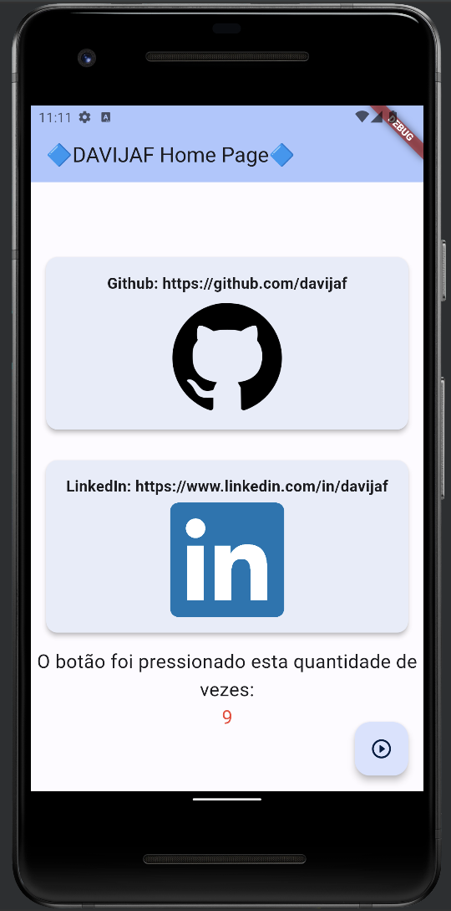

# Flutter Project: DAVIJAF App

This is a Flutter application that showcases a simple user interface with clickable cards that open GitHub and LinkedIn profiles when tapped. The app also features a counter that increases with each button press.

## Getting Started
This project is a starting point for a Flutter application.
To run this project, you'll need to have Flutter and Dart installed on your machine. If you haven't already, you can follow the official Flutter installation guide here: [Flutter Installation Guide](https://flutter.dev/docs/get-started/install)

### 1. Clone the repository:

   `git clone <repository-url>`

   

A few resources to get you started if this is your first Flutter project:

* [Lab: Write your first Flutter app](https://docs.flutter.dev/get-started/codelab)
* [Cookbook: Useful Flutter samples](https://docs.flutter.dev/cookbook)

For help getting started with Flutter development, view the
[online documentation](https://docs.flutter.dev/), which offers tutorials,
samples, guidance on mobile development, and a full API reference.

### 2. Navigate to the project directory:

    `cd flutter-davijaf-app`
    
### 3. Install dependencies:
    
    `flutter pub get`
    
### 4. Run the app:
    `flutter run`

## Project Structure
* lib/main.dart: The entry point of the application, containing the MyApp widget.
* lib/screens/my_home_page.dart: Defines the MyHomePage widget, which is the main screen of the app.
* lib/widgets/card_with_github_image.dart: Contains the CardWithGitHubImage widget, displaying the GitHub card.
* lib/widgets/card_with_linkedin_image.dart: Contains the CardWithLinkedInImage widget, displaying the LinkedIn card.

## Features

* The app uses the MaterialApp widget to define the theme and initial route.
* The MyHomePage widget manages the main screen UI, including the counter and the floating action button.
* The CardWithGitHubImage and CardWithLinkedInImage widgets display clickable cards with profile URLs and images.
* Tapping on the cards opens the respective profile URLs in a web browser.

## Contributing

Contributions are welcome! If you find any issues or would like to add new features, feel free to create a pull request.

